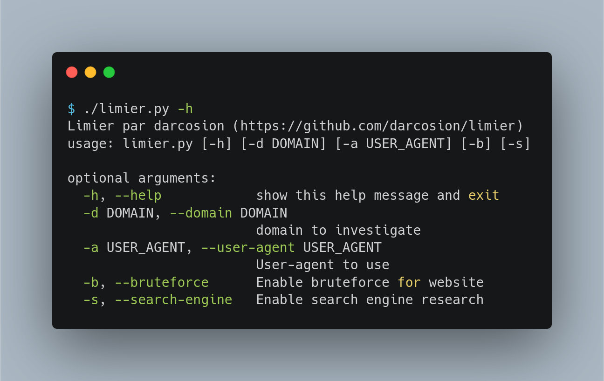
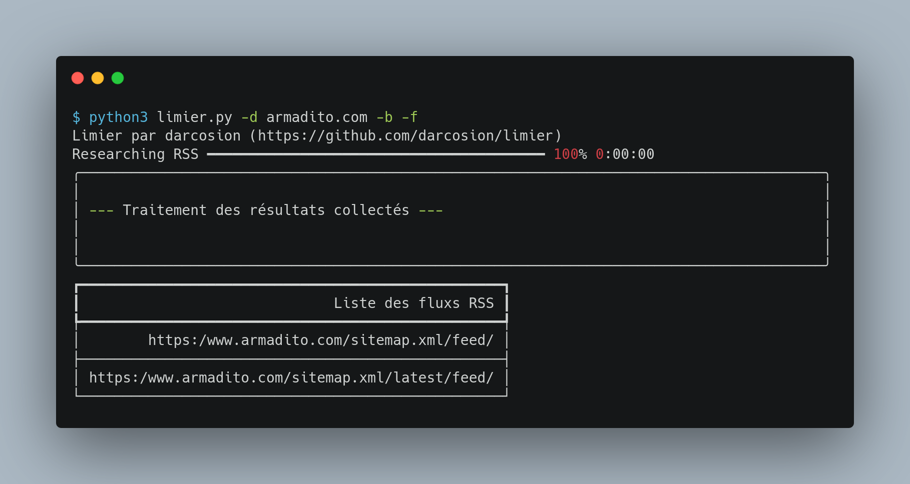

(for english people, [I've made a quick README](/README.en.md), but I don't want to do many support in english, so you can improve with pull request if you want)

# limier
Limier est un petit outil en CLI permettant de trouver un flux RSS quand il est planqué sur un site.

[](https://www.python.org/)

## installation

```
git clone  https://github.com/darcosion/limier
cd limier 
pip3 install requirements.txt
```

## Usage



### Exemple : 



## TODO : 
 - Identification des forums
 - Exploration d'arborescence de site
 - Vérification de cohérence des feed rss
